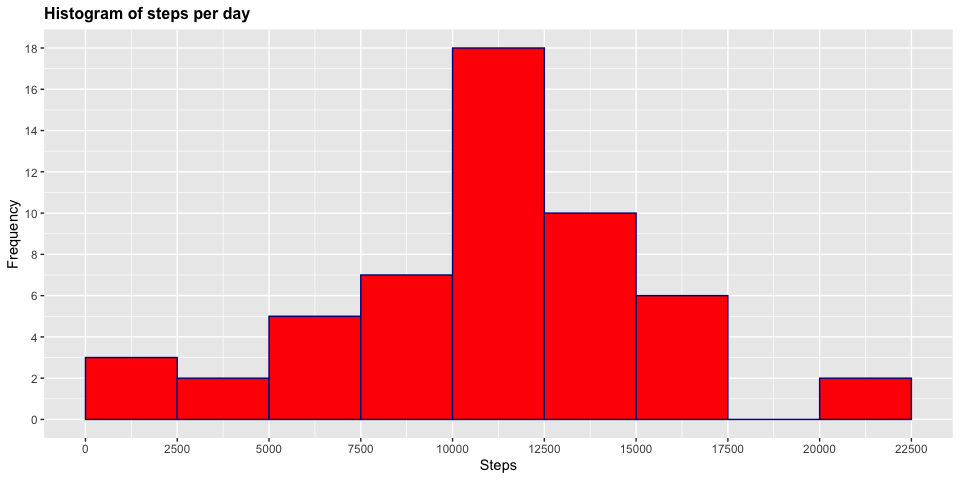
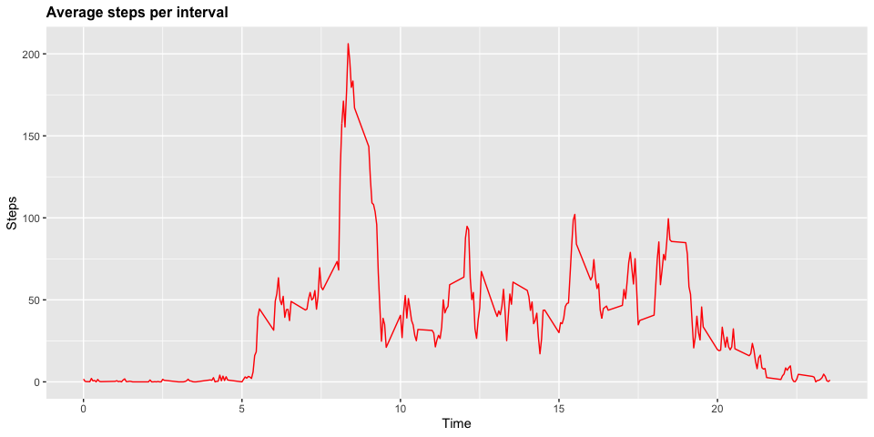
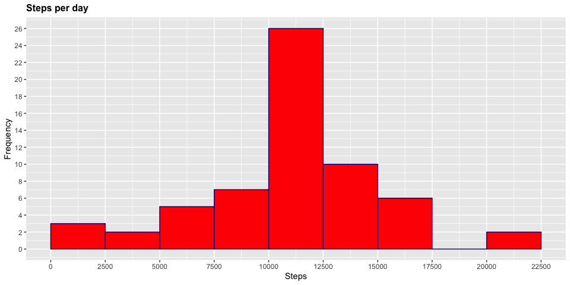
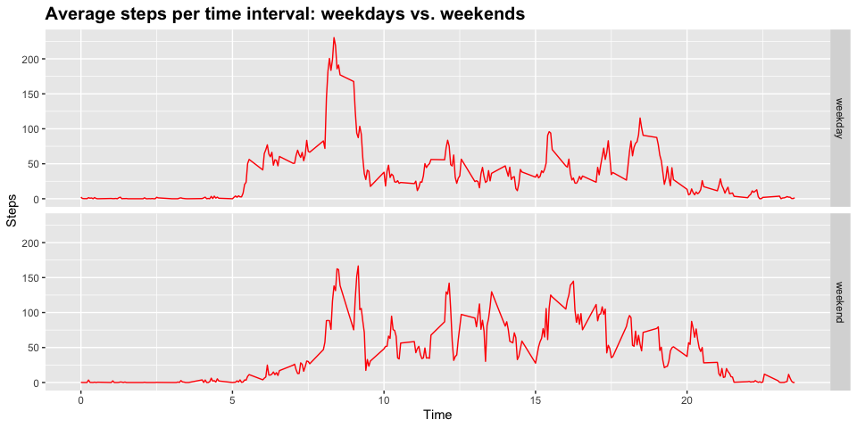

*Submission of Reproducible Research Course Project 1. More information view the [ReadMe](https://github.com/sinectica/RepData_PeerAssessment1/blob/master/README.md)*

The data for the assignment is available at this [link](https://github.com/sinectica/RepData_PeerAssessment1/blob/master/activity.zip).  

<br>

## Loading and preprocessing the data
*Show any code that is needed to*  
*1. Load the data (i.e. read.csv())*  
*2. Process/transform the data (if necessary) into a format suitable for your analysis*  


```r
# Import data
setwd("/Volumes/Macintosh HD/Reproducible Research")
activity <- read.csv("activity.csv")
# load libraries
library(ggplot2)
library(dplyr)
Sys.setlocale("LC_TIME", "English")
```

```
## [1] ""
```

```r
# Information about the dataset
str(activity)
```

```
## 'data.frame':	17568 obs. of  3 variables:
##  $ steps   : int  NA NA NA NA NA NA NA NA NA NA ...
##  $ date    : chr  "2012-10-01" "2012-10-01" "2012-10-01" "2012-10-01" ...
##  $ interval: int  0 5 10 15 20 25 30 35 40 45 ...
```

Variables:  
1. **steps**: Number of steps taking in a 5-minute interval (missing values are coded as NA)
2. **date**: The date on which the measurement was taken in YYYY-MM-DD format  
3. **interval**: Identifier for the 5-minute interval in which measurement was taken  

<br>
   
## Total number of steps taken per day 
*For this part of the assignment, missing values in the dataset are ignored.*  
*1. Calculate the total number of steps taken per day*  
*2. Make a histogram of the total number of steps taken each day*  
*3. Calculate and report the mean and median total number of steps taken per day*  
  
**1. Number of steps per day**


```r
# create and print number of steps per day
Steps_Per_Day <- aggregate(activity$steps, list(activity$date), FUN=sum)
colnames(Steps_Per_Day) <- c("Date", "Steps")
Steps_Per_Day
```

```
##          Date Steps
## 1  2012-10-01    NA
## 2  2012-10-02   126
## 3  2012-10-03 11352
## 4  2012-10-04 12116
## 5  2012-10-05 13294
## 6  2012-10-06 15420
## 7  2012-10-07 11015
## 8  2012-10-08    NA
## 9  2012-10-09 12811
## 10 2012-10-10  9900
## 11 2012-10-11 10304
## 12 2012-10-12 17382
## 13 2012-10-13 12426
## 14 2012-10-14 15098
## 15 2012-10-15 10139
## 16 2012-10-16 15084
## 17 2012-10-17 13452
## 18 2012-10-18 10056
## 19 2012-10-19 11829
## 20 2012-10-20 10395
## 21 2012-10-21  8821
## 22 2012-10-22 13460
## 23 2012-10-23  8918
## 24 2012-10-24  8355
## 25 2012-10-25  2492
## 26 2012-10-26  6778
## 27 2012-10-27 10119
## 28 2012-10-28 11458
## 29 2012-10-29  5018
## 30 2012-10-30  9819
## 31 2012-10-31 15414
## 32 2012-11-01    NA
## 33 2012-11-02 10600
## 34 2012-11-03 10571
## 35 2012-11-04    NA
## 36 2012-11-05 10439
## 37 2012-11-06  8334
## 38 2012-11-07 12883
## 39 2012-11-08  3219
## 40 2012-11-09    NA
## 41 2012-11-10    NA
## 42 2012-11-11 12608
## 43 2012-11-12 10765
## 44 2012-11-13  7336
## 45 2012-11-14    NA
## 46 2012-11-15    41
## 47 2012-11-16  5441
## 48 2012-11-17 14339
## 49 2012-11-18 15110
## 50 2012-11-19  8841
## 51 2012-11-20  4472
## 52 2012-11-21 12787
## 53 2012-11-22 20427
## 54 2012-11-23 21194
## 55 2012-11-24 14478
## 56 2012-11-25 11834
## 57 2012-11-26 11162
## 58 2012-11-27 13646
## 59 2012-11-28 10183
## 60 2012-11-29  7047
## 61 2012-11-30    NA
```

  
**2. Histogram of the total number of steps taken each day**


```r
# drawing the histogram
g <- ggplot(Steps_Per_Day, aes(Steps))
g+geom_histogram(boundary=0, binwidth=2500, col="darkblue", fill="red")+ggtitle("Histogram of steps per day")+xlab("Steps")+ylab("Frequency")+theme(plot.title = element_text(face="bold", size=12))+scale_x_continuous(breaks=seq(0,25000,2500))+scale_y_continuous(breaks=seq(0,18,2))
```

<!-- -->


**3. Mean and median of total number of steps taken per day**


```r
# Mean
mean(Steps_Per_Day$Steps, na.rm=TRUE)
```

```
## [1] 10766.19
```

```r
#Median
median(Steps_Per_Day$Steps, na.rm=TRUE)
```

```
## [1] 10765
```

<br>

## Average daily activity pattern
*1. Make a time series plot (i.e. type = "l") of the 5-minute interval (x-axis) and the average number of steps taken, averaged across all days (y-axis)*   
*2. Which 5-minute interval, on average across all the days in the dataset, contains the maximum number of steps?*   

**1. Time series plot of the 5 minute interval (x) and averaged number of steps taken averaged across all days (y)**


```r
# Table with steps per time
Steps_Per_Time <- aggregate(steps~interval,data=activity,FUN=mean,na.action=na.omit)
# Variable time
Steps_Per_Time$time <- Steps_Per_Time$interval/100
# Drawing the plot
h <- ggplot(Steps_Per_Time, aes(time, steps))
h+geom_line(col="red")+ggtitle("Average steps per interval")+xlab("Time")+ylab("Steps")+theme(plot.title = element_text(face="bold", size=12))
```

<!-- -->

**2. 5-minute interval (on average across all the days) with the maximum number of steps**


```r
# New Table
TABLE_STEPS <- tbl_df(Steps_Per_Time)
# Which column has the maximum steps
TABLE_STEPS %>% select(time, steps) %>% filter(steps==max(Steps_Per_Time$steps))
```

```
## # A tibble: 1 x 2
##    time steps
##   <dbl> <dbl>
## 1  8.35  206.
```

<br>
   
## Imputing missing values
*Note that there are a number of days/intervals where there are missing values (coded as NA). The presence of missing days may introduce bias into some calculations or summaries of the data.**  
**1. Calculate and report the total number of missing values in the dataset (i.e. the total number of rows with NAs)*  
*2. Devise a strategy for filling in all of the missing values in the dataset. The strategy does not need to be sophisticated. For example, you could use the mean/median for that day, or the mean for that 5-minute interval, etc.*  
*3. Create a new dataset that is equal to the original dataset but with the missing data filled in.*  
*4. Make a histogram of the total number of steps taken each day and Calculate and report the mean and median total number of steps taken per day. Do these values differ from the estimates from the first part of the assignment? What is the impact of imputing missing data on the estimates of the total daily number of steps?*   

**1. Total number of missing values in the dataset**


```r
# New table
MISSING_VALUES <- tbl_df(activity)
# Find missing values
MISSING_VALUES %>% filter(is.na(steps)) %>% summarize(missing_values = n())
```

```
## # A tibble: 1 x 1
##   missing_values
##            <int>
## 1           2304
```

**2. Replace missing values**  
The rounded values of the average 5-minute interval is used to replace the NA values.  
*CompleteSteps* is the new column without missing values.


```r
# Complete values (without NA) are pasted into a new column
activity$CompleteSteps <- ifelse(is.na(activity$steps), round(Steps_Per_Time$steps[match(activity$interval, Steps_Per_Time$interval)],0), activity$steps)
```

**3. New dataset that is equal to the original dataset but with the missing data filled in**   
The first ten values of the new dataset are shown below.  


```r
# New dataset
activity_complete <- data.frame(steps=activity$CompleteSteps, interval=activity$interval, date=activity$date)
# see first 10 values of the new dataset
head(activity_complete, n=10)
```

```
##    steps interval       date
## 1      2        0 2012-10-01
## 2      0        5 2012-10-01
## 3      0       10 2012-10-01
## 4      0       15 2012-10-01
## 5      0       20 2012-10-01
## 6      2       25 2012-10-01
## 7      1       30 2012-10-01
## 8      1       35 2012-10-01
## 9      0       40 2012-10-01
## 10     1       45 2012-10-01
```

**4A. Histogram of the total number of steps taken each day with missing data filled in**  


```r
# prepare data
SPD_COMPLETE <- aggregate(activity_complete$steps, list(activity_complete$date), FUN=sum)
colnames(SPD_COMPLETE) <- c("Date", "Steps")
# draw the histogram
g <- ggplot(SPD_COMPLETE, aes(Steps))
g+geom_histogram(boundary=0, binwidth=2500, col="darkblue", fill="red")+ggtitle("Steps per day")+xlab("Steps")+ylab("Frequency")+theme(plot.title = element_text(face="bold", size=12))+scale_x_continuous(breaks=seq(0,25000,2500))+scale_y_continuous(breaks=seq(0,26,2))
```

<!-- -->

**4B. Calculate and report the mean and median total number of steps taken per day. Do these values differ from the estimates from the first part of the assignment? What is the impact of imputing missing data on the estimates of the total daily number of steps?**  


```r
# Mean
mean(SPD_COMPLETE$Steps)
```

```
## [1] 10765.64
```

```r
#Median
median(SPD_COMPLETE$Steps)
```

```
## [1] 10762
```

<br>

## Are there differences in activity patterns between weekdays and weekends?
*For this part the weekdays() function may be of some help here. Use the dataset with the filled-in missing values for this part.*  
*1. Create a new factor variable in the dataset with two levels - "weekday" and "weekend" indicating whether a given date is a weekday or weekend day.*  
*2. Make a panel plot containing a time series plot (i.e. type = "l") of the 5-minute interval (x-axis) and the average number of steps taken, averaged across all weekday days or weekend days (y-axis).*  

**1. Create a new factor variable in the dataset with two levels - "weekday" and "weekend" indicating whether a given date is a weekday or weekend day.**  
*DayType* is the new column indicating if the day is a weekday day or a weekend day: the first ten values of the new table are shown


```r
# Create variable with date in correct format
activity_complete$RealDate <- as.Date(activity_complete$date, format = "%Y-%m-%d")
# create a variable with weekdays name
activity_complete$weekday <- weekdays(activity_complete$RealDate)
# create a new variable indicating weekday or weekend
activity_complete$DayType <- ifelse(activity_complete$weekday=='Saturday' | activity_complete$weekday=='Sunday', 'weekend','weekday')
# see first 10 values
head(activity_complete, n=10)
```

```
##    steps interval       date   RealDate weekday DayType
## 1      2        0 2012-10-01 2012-10-01  Monday weekday
## 2      0        5 2012-10-01 2012-10-01  Monday weekday
## 3      0       10 2012-10-01 2012-10-01  Monday weekday
## 4      0       15 2012-10-01 2012-10-01  Monday weekday
## 5      0       20 2012-10-01 2012-10-01  Monday weekday
## 6      2       25 2012-10-01 2012-10-01  Monday weekday
## 7      1       30 2012-10-01 2012-10-01  Monday weekday
## 8      1       35 2012-10-01 2012-10-01  Monday weekday
## 9      0       40 2012-10-01 2012-10-01  Monday weekday
## 10     1       45 2012-10-01 2012-10-01  Monday weekday
```

**2. Two time series plot of the 5-minute interval (x) and the average number of steps taken averaged across weekday days or weekend days (y).**  


```r
# Table with steps per time weekdays or weekend days
Steps_Per_Time_W <- aggregate(steps~interval+DayType,data=activity_complete,FUN=mean,na.action=na.omit)
# Variable time
Steps_Per_Time_W$time <- Steps_Per_Time$interval/100
# Drawing the plot
j <- ggplot(Steps_Per_Time_W, aes(time, steps))
j+geom_line(col="red")+ggtitle("Average steps per time interval: weekdays vs. weekends")+xlab("Time")+ylab("Steps")+theme(plot.title = element_text(face="bold", size=15))+facet_grid(DayType ~ .)
```

<!-- -->
